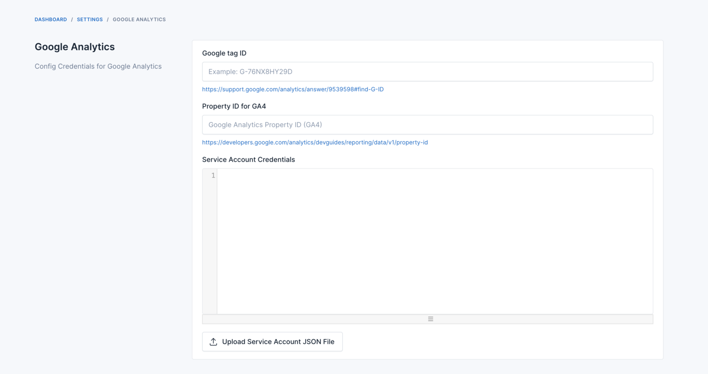
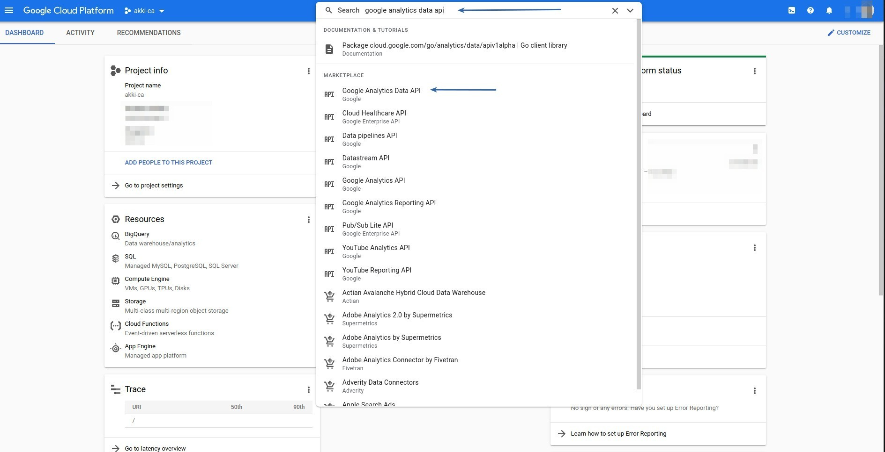
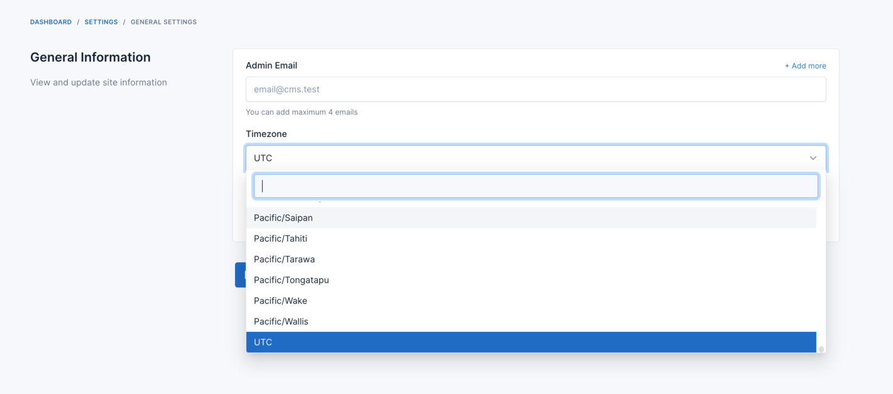
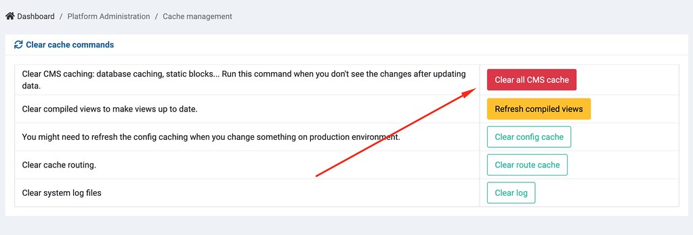

# Analytics

Integrate with Google Analytics

## Getting credentials

Please check instruction in Admin -> Settings -> General.

Google tag ID: https://support.google.com/analytics/answer/9539598#find-G-ID

Property ID: https://developers.google.com/analytics/devguides/reporting/data/v1/property-id

Service Account Credentials: https://github.com/akki-io/laravel-google-analytics/wiki/2.-Configure-Google-Service-Account-&-Google-Analytics

## Troubleshooting

### Service is not enabled

If you got this error:

You need to enable "Google Analytics Data API".

Select project

Search for API

Enable API

### Setup timezone and clear cache

- Go to Admin -> Settings -> General and setup timezone to your local timezone.

- Go to Admin -> Platform Administration -> Cache management and clear your site cache.

::: warning
Analytics data in Admin dashboard is displayed daily data, so it will reset chart every day. It is displaying data from
API, not realtime analytics so please wait until your site has data from API.
:::

Give your comment here if you got any problem.

Good luck!
