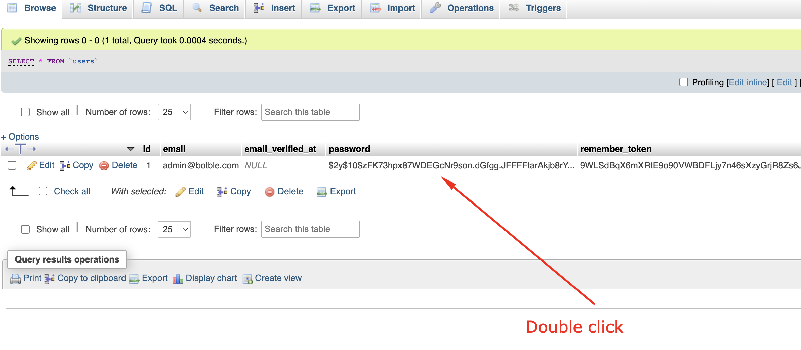
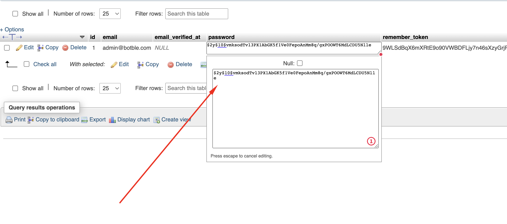

# Reset admin password

- Go to your database, open table `users` and update column `password` with
  value `$2y$10$vmksodTvl3PX1AbGK5f1Ve0FepoAnMm8q/gxPOOWT6MdLCDU5Nlle`

- Then you can log in to the admin panel using your username (you can find your username in table `users`) and
  password `159357`
